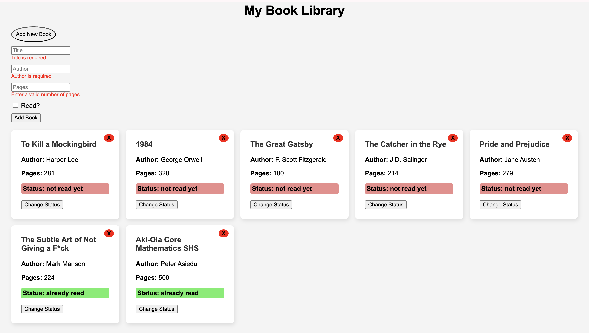

# Library
A simple web application to manage your personal book collection. Add, remove, and track books you've read or want to read.


## Features
- Add books with title, author, page count, and read status
- View all books in a responsive card layout
- Toggle read/unread status
- Delete books from the library
- Sample books preloaded on startup
- Custom form validation with inline error messages

## Technologies Used
- **HTML5** — markup structure
- **CSS3** — basic layout and styling
- **Vanilla JavaScript (ES6)** — core functionality, DOM manipulation
- **UUID API** — generates unique IDs for each book entry

## Project Structure
```bash
library-app/
├── index.html          # Main HTML file
├── style.css           # Stylesheet
├── script.js           # Main JavaScript application
├── library_screenshot  # Screenshot of the default library
└── README.md           # This documentation
```

## How to Use
1. Clone or download the repository.
2. Open `index.html` in your browser.
3. Click **"Add New Book"** to toggle the form.
4. Fill in book details and submit.
5. Books will appear as cards. Use the buttons to:
   - ❌ Delete a book
   - 🔄 Change read status

## Validation & Error Handling

- Custom JavaScript form validation checks:
  - Title must not be empty
  - Author must not be empty
  - Pages must be a positive number
- Error messages are shown inline next to the respective fields.

## Future Improvements

- Save data to `localStorage` so it persists on page reload
- Add book cover image support
- Search or filter books by title/author/read status
- Improve styling and responsive layout

## Acknowledgements

**The Odin Project**
